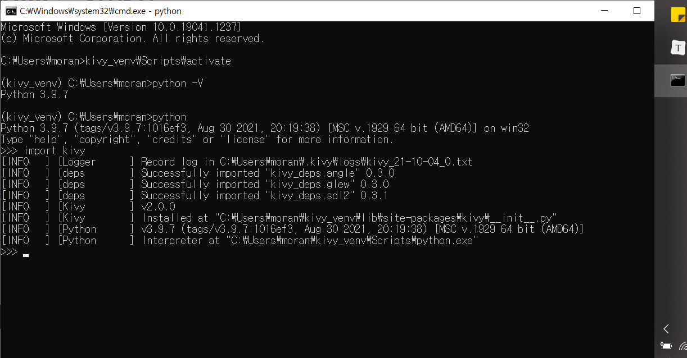

# 수업, 질의응답 내용

7단계공학설계 프로세스 모델링
: 4단계 분석과선택 - uml 다이어그램

웹페이지에서 다 처리가 되어야 한다
안드로이드에서 데이터를 보여주기만 해야 한다
=> 웹페이지와 서버를 만들어야 할 수도 있다.

## 총 제출물 5개 (1/5)
~~계획서~~ 
중간보고서 (8주차 즈음) 
최종보고서 
ppt 
유튜브 

실패하더라도, 실패한 과정을 쓰기

# python, kivy 설치하기 
## python
https://www.python.org/ftp/python/3.9.7/python-3.9.7-amd64.exe
python -V  
3.9.7

## kivy
https://kivy.org/doc/stable/gettingstarted/installation.html#kivy-source-install

설치확인
kivy_venv\Scripts\activate (kivy_venv 라는 가상환경)
python
>import kivy

# vscode에서 개발하기
https://code.visualstudio.com/download
인터프리터를 kivy_venv 가상환경 내의 python으로 설정해 준다!
import kivy해보기

# git branch 파기
자기 이름 브랜치 만들기
커밋하기
브랜치 이동하기 (checkout) (커밋되지 않은 변경사항이 있을 때 체크아웃 불가능)
fetch하기 (원격에서 새로운 업데이트있나 확인)
pull하기 (원격 내용(fetch한 내용) 로컬로 가져오기)
push하기 (로컬 내용 원격에 적용하기)

## 타인소유의 레포지토리에 push하기
1. 접근권한을 얻는다. **레포지토리 소유자가 Manage access에서 collaborator로 등록하고 수락해야 한다.**

2. C:\Users\(사용자이름)\Will-it-rain 폴더를 삭제한다
3. github에서 (초록색버튼) Code-> Open with Github Desktop
4. 원하는 로컬 경로 선택 (잘 기억!)
5. visual studio code들어가기
6. 4번에서 사용한 경로의 폴더 열기
7. 자기 이름 브랜치 만들기
8. 자기 이름 브랜치에서 (이름)_test.py 만들기
9. python interpreter 선택하기 (C:\Users\(사용자이름)\kivy_venv\Scripts\Python.exe) **중요
10. (이름)_test.py 에 import kivy와 print("hello") 해서 실행시켜보기
11. 소스제어 메뉴들어가서 commit 메세지 입력하고 변경사항 '+'눌러서 스테이지 하기. 커밋하기
12. push하기
13. https://github.com/moran991231/Will-it-rain 에 들어가서 'main'버튼 누르면 브랜치들을 확인할 수 있다. 자기가 만든 브랜치가 있는지 확인한다.